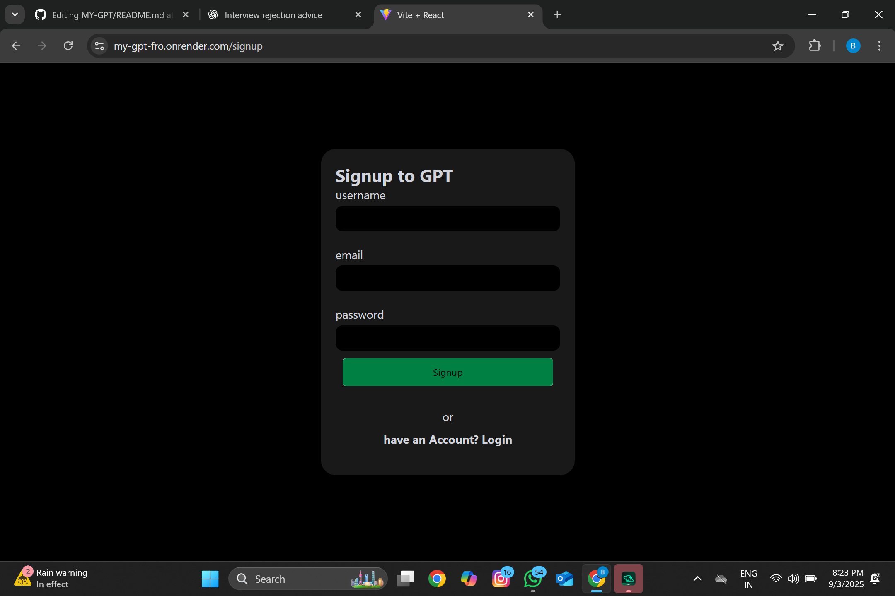
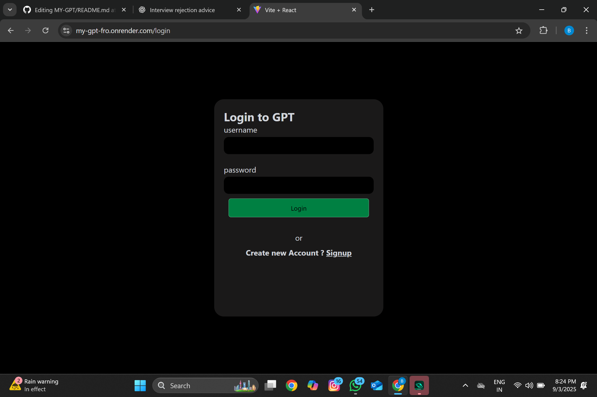
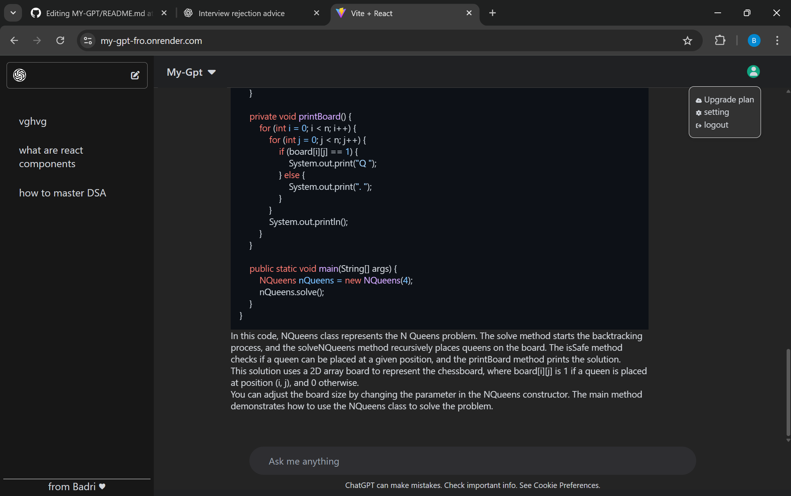

# ChatGPT Clone

A full-stack AI-powered chat application built using **React** and **Node.js/Express**, integrated with **OpenAI API**. The app allows users to interact with a chatbot similar to ChatGPT in real-time.

---

## **Features**
- AI-powered chatbot using OpenAI API
- Responsive UI built with React
- Real-time chat functionality
- Clean, modular code structure
- Deployment-ready (hosted on Render)

---

## **Tech Stack**
- **Frontend:** React, Axios, CSS
- **Backend:** Node.js, Express
- **Database (optional):** MongoDB
- **Deployment:** Render

---







---


[Click here to try the app](YOUR_RENDER_LINK)

---

## **Setup & Installation**

1. Clone the repository:
   ```bash
   git clone https://github.com/yourusername/chatgpt-clone.git
